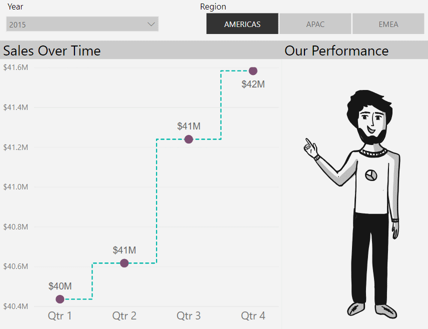
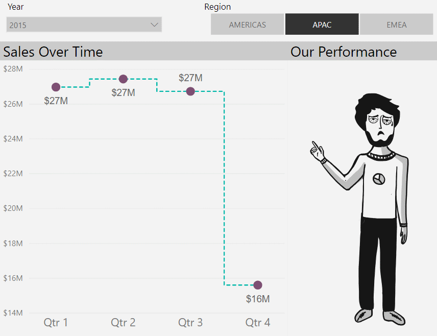
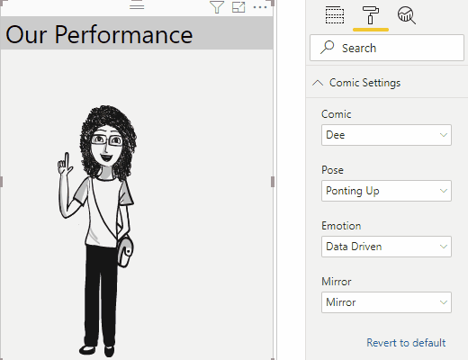

# Comicgen

Comicgen adds comic characters whose emotion, pose, angle, etc can be controlled by data. This helps convey the right emotion and increase engagement.





*Have Fun!*

## Usage

1. Import the package into to Power-BI Desktop
2. Create `Measure` for both `Emotion` and `Pose`
3. The `Measure` should return one of the Emotion or Pose respectively. Below is an example:
```
ProfitEmotion = IF(CALCULATE(SUM([Profit]) > 60, "smile", "tired")

SalesPose = IF(CALCULATE(SUM([Sales]) > 1000, "yuhoo", "angryfrustated")
```
4. Drag and Drop these `Measures` to respective Data Fields.
5. Goto `Format Pane` and expand `Comic Settings`
6. Select `Data Driven` in `Emotion` and `Pose` to bind the comics with data or you can override it by selecting your preferred `Emotion` and `Pose` from the dropdown. List of these poses and Emotions are available in below sections




The list of emotions are:

- normal
- laugh
- sad
- wink

The list of poses are:

- pointingright
- pointingup
- yuhoo
- superperfect
- holdinglaptop
- angryfrustrated
- handsfolded
- handsonhip
- holdingbook
- readingpaper
- thumbsup
- thinkinghmm

## Dev Setup

1. Clone this repository
2. Install JS modules Run `npm install`
3. Start Server `pbiviz start`

## Notes

- License: [MIT](https://opensource.org/licenses/MIT)
- [End-user license agreement](https://visuals.azureedge.net/app-store/Power%20BI%20-%20Default%20Custom%20Visual%20EULA.pdf)
